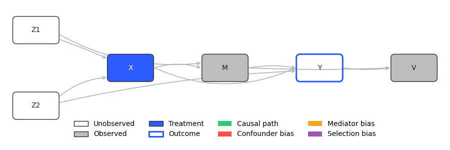

# Inga 因果: Causal Synthetic Tabular Data Toolkit

 [](https://www.python.org/downloads/) [](https://pypi.org/project/inga/) [](https://pypi.org/project/inga/)

`inga` is a toolkit for generating and inspecting synthetic tabular datasets. It constructs arbitrarily complex Structural Causal Models (SCMs), draws samples from them, and computes causal effects and causal biases conditioned on observed variables and outcomes. All computed quantities are stored and made available for causally-informed pre-training of tabular models.



## Causal Effect and Causal Bias

The current scope of this repository is restricted to SCMs with continuous variables. Let $V_i$ denote a generic scalar variable in the SCM, and let $U_{V_i} \sim 𝒩(0,1)$ be its corresponding exogenous noise, such that

$$
V_i := f_{V_i}(\mathrm{Pa}(V_i), U_{V_i})
     := \bar{f}_{V_i}(\mathrm{Pa}(V_i)) + \sigma_{V_i} U_{V_i}.
$$

Here, $\mathrm{Pa}(V_i)$ denotes the set of parents of $V_i$ in the DAG, $\bar f_{V_i}$ captures the deterministic structural component, and $\sigma_{V_i}$ controls the scale of the exogenous noise.

In particular, let $X$ denote a treatment variable, $Y$ an outcome, and $𝒪$ a set of observed variables. Under mild regularity assumptions [(Detommaso et al.)](https://arxiv.org/abs/2106.09762), the causal effect and causal bias for a given treatment value $x$ and observation vector $o$ are defined as

```math
\begin{aligned}
𝒞_X(x, o) 
&:= 𝔼\big[\nabla_x f_Y^x \,\big|\, x, o\big], \\
ℬ_X(x, o) 
&:= -\sum_{V_i \in \{X\}\cup 𝒪}
\frac{1}{\sigma_{V_i}} 𝔼\Big[
\Big(
\nabla_{V_i} f_Y^{x,o} - (f_Y^{x,o} - 𝔼[Y \mid x, o])\, U_{V_i}
\Big)
\nabla_x (f_{V_i}^{x,o} - v_i)
\,\Big|\, x, o
\Big].
\end{aligned}
```

Here, $f_{V_i}^{a}$ denotes the structural function $f_{V_i}$ under intervention $A=a$. All expectations are taken with respect to the posterior distribution $p(U \mid x, o)$, where $U$ is the vector of all exogenous noise variables.

`inga` approximates this posterior using a robust Laplace approximation, enabling scalable computation in high-dimensional settings and across batches of observations $(x, o)$.

One can show that the association between treatment $X$ and outcome $Y$ decomposes into causal effect and causal bias:

$$
𝒜_X(x, o)
:= \nabla_x 𝔼[Y \mid x, o]
= 𝒞_X(x, o) + ℬ_X(x, o).
$$

## Causally Consistent Pre-Training

Causal effect and causal bias provide a granular characterization of how information propagates from observed variables to the outcome within the DAG.

Standard point-estimation models aim to approximate the conditional expectation $𝔼[Y \mid x, o]$, but they do not distinguish between contributions arising from causal pathways and those arising from non-causal (e.g., confounding or purely statistical) dependencies. As a result, the underlying data-generating process is often unidentifiable, which can lead to suboptimal generalization and brittleness under distribution shift.

Consider an encoder model $z := h(o)$ and a prediction head $\hat{y}(z)$. Introduce two additional heads, $\hat{c}_j(z)$ and $\hat{b}_j(z)$, intended to learn the causal effect and causal bias from $O_j$ (treated as the treatment variable) to $Y$. We say that the model is **causally consistent** for $O_j$ if

$$
\begin{aligned}
\nabla_{o_j} \hat{y} &= \hat{c}_j + \hat{b}_j, \\
\hat{c}_j &= 𝒞_{O_j}(o_j, o), \\
\hat{b}_j &= ℬ_{O_j}(o_j, o).
\end{aligned}
$$

`inga` enables causally consistent pre-training by generating synthetic datasets that include the full set of causal effects $𝒞_{O_j}(o_j, o)$ and causal biases $ℬ_{O_j}(o_j, o)$. These quantities can be incorporated directly into training objectives, encouraging models to learn representations that respect the causal structure of the data-generating process.

### A Small Benchmark
The small benchmark [causal_consistency_benchmark.py](examples/causal_consistency_benchmark.py) demonstrates this intution. A simple MLP encoder is attached to three linear heads, respectively predicting outcomes, causal effects and causal biases. The model is trained and tested individually on splits of 30 randomly generated synthetic dataset. 

<pre>
+--------------------+----------------+-------------------+-------------------------+
| method_type        | prediction_mae | causal_effect_mae | prediction_win_fraction |
+--------------------+----------------+-------------------+-------------------------+
| standard           | 0.7909 [0.31]  | 0.3353 [0.45]     | 0.0667                  |
| l2                 | 0.7868 [0.31]  | 0.3141 [0.46]     | 0.0667                  |
| causal_consistency | <b>0.7694</b> [0.31]  | <b>0.0461</b> [0.21]     | <b>0.8667</b>                  |
+--------------------+----------------+-------------------+-------------------------+
</pre>

The table shows that not only the model trained using causal consistency provides much more reliable causal effect estimates, but also decreases the generalization error on ~87% of the datasets. Results can be replicated by running `uv run python examples/causal_consistency_benchmark.py`.

## How To:

### Install
Get `inga` from PyPI:

```bash
pip install inga
```

Alternatively, clone the repository:

```bash
git clone https://github.com/gianlucadetommaso/inga.git
cd inga
```

Sync dependencies:

```bash
uv sync
```

Run scripts, for example:

```bash
uv run python -m examples/explore.py
```

### Create a DAG
You can create and draw the DAG of a SCM as follows:
```python
from inga.scm import SCM, Variable

scm = SCM(
    variables=[
        Variable(name="Z"),
        Variable(name="X", parent_names=["Z"]),
        Variable(name="Y", parent_names=["Z", "X"]),
    ]
)

scm.draw(output_path="YOUR_DAG.png")
```

### Create a SCM
The class `Variable` defines a variable $V_i$ in the DAG, but leaves the mean function $\bar f_{V_i}$ empty. To complete the SCM and compute causal quantities, you have to create a child class that defines the mean function. For example:

```python
import torch
from torch import Tensor
from inga.scm import Variable

class MyVariable(Variable):
    def f_mean(self, parents: dict[str, Tensor]) -> Tensor:
        f_mean: Tensor | float = 0.0

        for parent in parents.values():
            f_mean = f_mean + torch.sin(parent)
        
        return f_mean
```

An example of built-in `Variable` with defined mean function is [LinearVariable](inga/scm/variable/linear.py). Now, Let's update the SCM using our newly defined variable class!

```python
from inga.scm import SCM

scm = SCM(
    variables=[
        MyVariable(name="Z", sigma=1.0),
        MyVariable(name="X", sigma=1.0, parent_names=["Z"]),
        MyVariable(name="Y", sigma=1.0, parent_names=["Z", "X"]),
    ]
)
```

### Compute causal effect and causal bias
We are ready to compute causal effect and causal bias. We need to define treatment variable, outcome variable and observed variables. Note: the treatment should always be observed, while the outcome should never be. Here an example:

```python
from torch import Tensor

treatment_name, outcome_name = "X", "Y"
observed = {"X": Tensor([1.])}

scm.posterior.fit(observed)

causal_effect = scm.causal_effect(
    observed=observed, 
    treatment_name=treatment_name, 
    outcome_name=outcome_name
)
causal_bias = scm.causal_bias(
    observed=observed, 
    treatment_name=treatment_name, 
    outcome_name=outcome_name
)
```

### Explore the dataset
You can investigate the dataset interactively by exporting the SCM to HTML:

```python
scm.export_html(
    output_path="YOUR_SCM.html",
    observed_ranges={"X": (-2.0, 2.0)}
)
```

For an exmaple, run `uv run python examples/explore.py` or checkout [datacard.html](https://htmlpreview.github.io/?https://github.com/gianlucadetommaso/inga/blob/main/plots/datacard.html).

### Generate, save and load SCM datasets
Given that we have constructed our SCM, let's generate, save and load a SCM dataset. 

```python
from inga.scm import CausalQueryConfig, load_scm_dataset

dataset = scm.generate_dataset(
    num_samples=128,
    seed=123,
    queries=[
        CausalQueryConfig(
            treatment_name="X",
            outcome_name="Y",
            observed_names=["X"],
        ),
    ],
)

dataset_path = "YOUR_DATASET.json"
dataset.save(dataset_path)
loaded_dataset = load_scm_dataset(dataset_path)
```

Alternatively, you can generate datasets at random from config as follows:

```python
from inga.scm.dataset import SCMDatasetConfig, generate_scm_dataset
from inga.scm.random import RandomSCMConfig

config = SCMDatasetConfig(
    scm_config=RandomSCMConfig(num_variables=4, parent_prob=0.5, seed=7),
    num_samples=128,
    num_queries=2,
    min_observed=1,
    seed=42,
)

dataset = generate_scm_dataset(config)
```

## Cite Inga
If you use `inga` in academic work, you can cite it with the following BibTeX entry:

```bibtex
@software{detommaso_inga,
  author = {Detommaso, Gianluca},
  title = {Inga: Causal Synthetic Tabular Data Toolkit},
  url = {https://github.com/gianlucadetommaso/inga},
  year = {2026},
  note = {GitHub repository}
}
```

## License

Licensed under the [MIT License](LICENSE).
